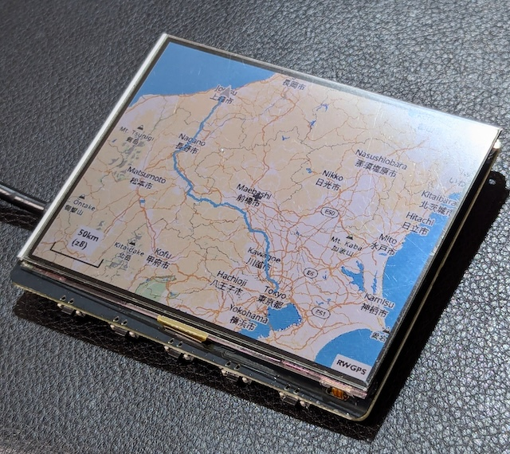
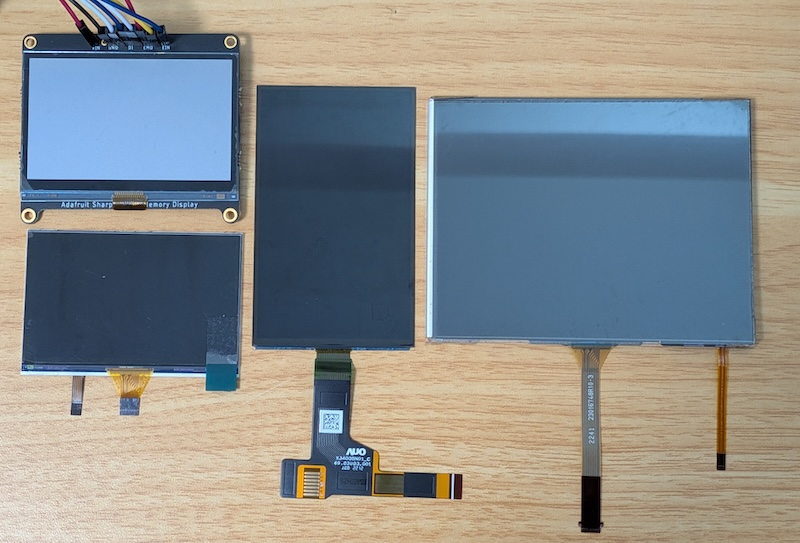
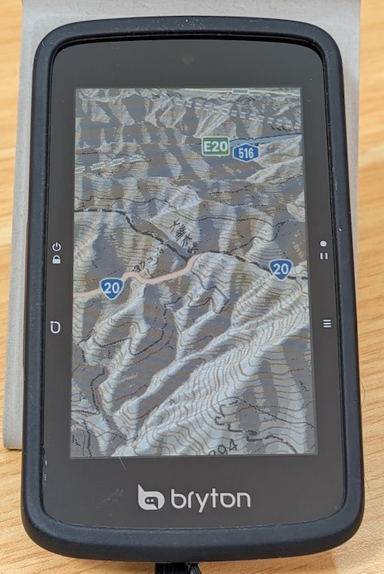
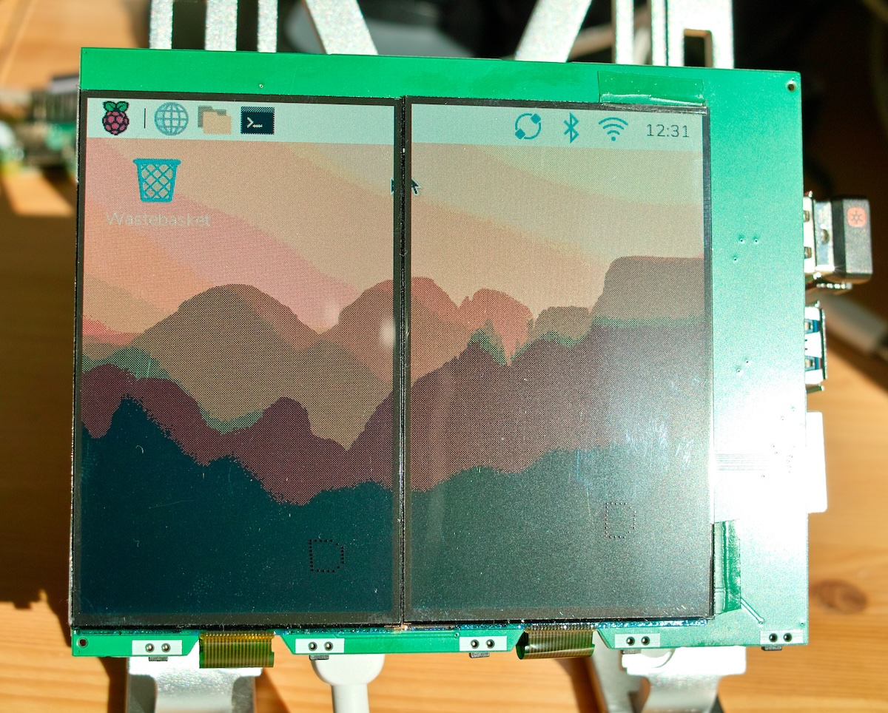
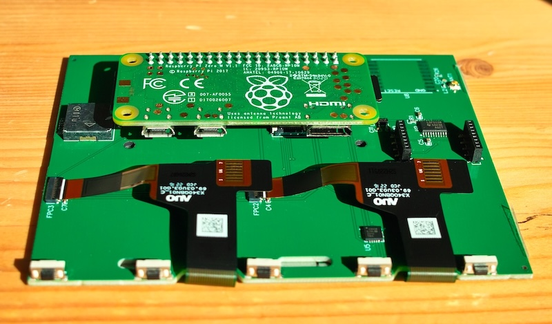
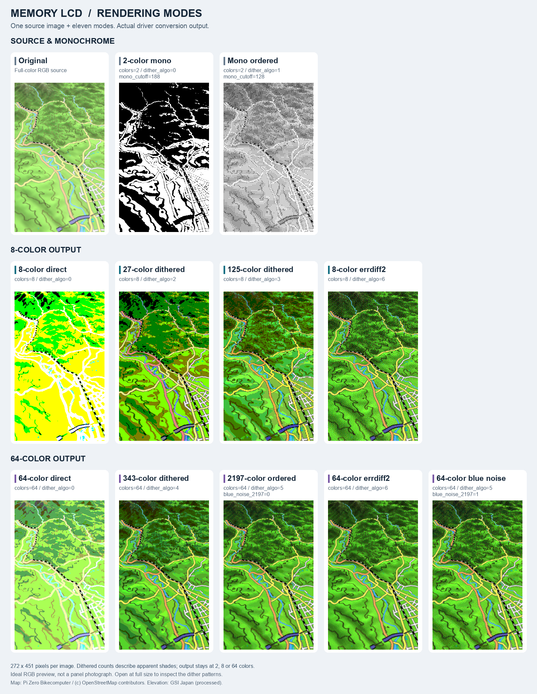

# Memory LCD DRM Driver

English | [日本語](README_ja.md)

https://github.com/hishizuka/memory-lcd-drm

A Linux DRM/KMS kernel driver for SPI memory LCD panels on Raspberry Pi,
including Sharp monochrome Memory LCDs, JDI 8-color MIP panels, and AUO
64-color MIP panels.



A JDI 4.4-inch MIP LCD in use.

**Videos and updates**

* [YouTube](https://www.youtube.com/channel/UCEk2Lxj_nTrZM3sOWQ39l6g):
  Videos of the hardware in use, including video playback at 30 fps.
* [X (@pi0bikecomputer)](https://x.com/pi0bikecomputer):
  Updates from Pi Zero Bikecomputer.

This repository focuses on practical hardware use: broad panel support,
64-color panels, dithering, optimized SPI updates, and pinout documentation
that matches the supplied device tree overlays. The kernel module and overlay
retain the name `sharp-drm` for compatibility with existing installation
scripts and Raspberry Pi `dtoverlay` settings.

## Main Features

Support ranges from monochrome to 64-color panels, with improvements to
rendering quality and display updates.

* **Broad panel support**: One DRM driver handles Sharp monochrome panels,
  JDI 8-color MIP panels, JDI 4.4-inch panels, and AUO 64-color panels.
* **64-color MIP support**: AUO U340QBN01 works as a single 272x451 panel or
  as two panels side by side, forming a 544x451 display.
* **Extended color rendering**: Ordered dithering represents intermediate
  shades equivalent to 27 or 125 colors on 8-color panels, and 343 or 2197
  colors on 64-color panels. Blue-noise dithering and error diffusion are
  also supported. Conversion is optimized to minimize its impact on update
  speed. See [Color and Dithering Settings](#color-and-dithering-settings)
  for a visual comparison.
* **Backlight support**: Adjust brightness through the standard Linux
  backlight interface, with smooth transitions between brightness levels.
* **Less SPI traffic through row comparison**: Even within a notified update
  region, unchanged rows are skipped to reduce SPI traffic.
* **Update pipeline**: Conversion of the next image can proceed during SPI
  transfer, reducing waiting during continuous updates compared with running
  conversion and transfer in sequence.
* **Direct video DMA-BUF input**: Avoid full-frame copies of decoded images
  into a separate display framebuffer. Supplied
  [FFmpeg patches and playback instructions](contrib/ffmpeg-rpi-isp/README.md)
  use this path. See [Video Playback](#video-playback) for the changes needed
  in an application.
* **Faster ARM64 image conversion with NEON**: On 64-bit ARM systems with
  NEON, CPU instructions that process multiple pixels at once accelerate
  image conversion. Supported paths include RGB conversion to 2/8/64 colors,
  ordered dithering, and 64-color blue-noise dithering. NV12 video uses NEON
  for part of its 64-color conversion; error diffusion does not use it.
  SPI transfer speed can still limit the overall display update rate.
* **Runtime adjustments**: Color mode, dithering, monochrome threshold,
  inversion, blinking, and clearing are exposed as sysfs module parameters.
  Brightness uses the standard Linux backlight class.
* **Hardware configuration documentation**: This README provides Raspberry
  Pi pinouts, `config.txt` examples, dual-panel wiring notes, and guidance on
  sharing PWM resources with devices such as buzzers.

Mainline Linux 6.13 and later includes the `sharp-memory` DRM driver
(`drivers/gpu/drm/tiny/sharp-memory.c`), which targets monochrome Sharp panels
declared in a board's device tree. This driver provides a ready-to-use
Raspberry Pi setup for JDI and AUO color panels, dithering, dual-panel mode,
and `dtoverlay` configuration in `config.txt` without rebuilding the kernel.

## Supported Panels

The panels below show differences in screen size, shape, and connectors.



Top left: LS027B7DH01; bottom left: LPM027M128B; center: U340QBN01; right: LPM044M141A.

Purchase links and availability notes are taken from the
[Pi Zero Bikecomputer hardware guide](https://github.com/hishizuka/pizero_bikecomputer/blob/master/doc/hardware_installation.md).
Listings can change; check the panel model and connector before buying.

| Family | Example panel | Modes | Sources |
| --- | --- | --- | --- |
| Sharp monochrome | LS027B7DH01 | 400x240, 2 colors | [Adafruit Memory Display Breakout](https://www.adafruit.com/product/4694) |
| Sharp monochrome | LS044Q7DH01 | 320x240, 2 colors | [Digikey](https://www.digikey.jp/ja/products/detail/sharp-microelectronics/LS044Q7DH01/5054070) |
| JDI 2.7-inch MIP | LPM027M128B / LPM027M128C | 400x240, 2 / 8 colors | [AliExpress bare panel](https://www.aliexpress.com/item/1005002351792191.html), [Wahoo wfcc4 (Roam V1) replacement assembly](https://www.aliexpress.com/item/1005008210004927.html) |
| JDI 4.4-inch MIP | LPM044M141A | 640x480, 2 / 8 colors | [DigiKey](https://www.digikey.jp/ja/products/detail/azumo/12567-06-T3/10492348) (discontinued) |
| AUO color MIP | U340QBN01 | 272x451, 8 / 64 colors | [Alibaba](https://www.alibaba.com/product-detail/3-4-Inch-TFT-LCD-Display_1601438380650.html), [Youritech](https://youritech-online.com/products/u340qbn01-0-with-front-light-3-4-inch-sunlight-readable-lcd-display-272x451-reflective-spi-sunlight-readable-mip-display?variant=52037710479669), Bryton Rider S800 |
| AUO 64-color MIP x2 | U340QBN01 x2 | 544x451, 64 colors | [Alibaba](https://www.alibaba.com/product-detail/3-4-Inch-TFT-LCD-Display_1601438380650.html) or [Youritech](https://youritech-online.com/products/u340qbn01-0-with-front-light-3-4-inch-sunlight-readable-lcd-display-272x451-reflective-spi-sunlight-readable-mip-display?variant=52037710479669) (two U340QBN01 panels) |

See [Panel Configuration Examples](#panel-configuration-examples) for the
settings for each panel. U340QBN01 dual-panel mode forces `colors=64`.

### Hardware Photos

An AUO U340QBN01 (Bryton Rider S800) displaying a 3D map in 64 colors on a
272x451 panel.



Two of the same panels side by side form a 544x451 display.



The back of the dual-panel board, showing a Raspberry Pi Zero W connected
to two panels. This assembly photo does not show the individual signal connections.



## Connections and Pin Assignment

When reusing a panel or interface board from an existing product, identify its
model and signal connections first, then adapt the overlay to the differences
from the defaults below. This can provide a migration path for supported panels
whose old driver no longer works with a newer kernel. Power requirements, signal
polarity, and backlight driver compatibility still need to be checked for each product.

### Default GPIO Mapping

The default `rpi` overlay uses Raspberry Pi SPI0 and BCM GPIO numbering.
MISO/GPIO9 is not used by the display and is intentionally left out of the SPI
pinctrl setup. The pin table below describes the `rpi` overlay.

| Display signal | Default BCM GPIO | 40-pin header pin | Notes |
| --- | --- | --- | --- |
| SPI0 MOSI / SI | GPIO10 | 19 | Pixel data from the Raspberry Pi to the panel |
| SPI0 SCLK / SCK | GPIO11 | 23 | SPI clock |
| SPI0 CE0 / SCS | GPIO8 | 24 | First panel chip select, active high (`spi-cs-high`) |
| SPI0 CE1 / SCS | GPIO7 | 26 | Second panel chip select in dual-panel mode (`dual_panel=1`) |
| EXTCOMIN / VCOM | GPIO24 | 18 | Software-toggled by the driver; 128 Hz for `panel_type=jdi`, 1 Hz for `panel_type=sharp_mono` |
| DISP | GPIO25 | 22 | Display enable / power control |
| Backlight PWM | GPIO18 | 12 | Optional PWM0 channel 0 output; enabled by `backlight_pwm` or any `backlight_*` overlay option |
| 3V3 / GND | Board power pins | 1 or 17 / any GND | Power wiring is board-specific and is not controlled by the overlay |

Use BCM GPIO numbers in `dtoverlay` parameters, not physical header pin numbers.

### Where to Change Pin Assignments

Edit [`overlays/sharp-drm-rpi.dts`](overlays/sharp-drm-rpi.dts). Backlight pins can
be changed through `config.txt` parameters; other assignments currently require
editing the overlay source.

| Signal to change | Location | Settings to keep consistent |
| --- | --- | --- |
| EXTCOMIN / VCOM | `sharp_pins` in `fragment@2`, `vcom-gpios` in `fragment@4` | First GPIO in `brcm,pins` and the GPIO number in `vcom-gpios` |
| DISP | `sharp_pins` in `fragment@2`, `disp-gpios` in `fragment@4` | Second GPIO in `brcm,pins` and the GPIO number in `disp-gpios` |
| SPI chip select | `sharp_drm` node name and `reg` in `fragment@4`, controller CS configuration | `reg` is a CS index, not a GPIO number: `0` for CE0, `1` for CE1 |
| SPI bus, MOSI, SCLK | `target` in `fragment@0` and `fragment@4`, pin configuration in `fragment@1` | The controller and its supported pin functions; changing numbers alone cannot route SPI to arbitrary GPIOs |
| Backlight PWM | `backlight_pin`, `backlight_pwm_func`, `backlight_pwm_channel` in `config.txt` | A compatible hardware PWM pin, function, and channel |

For example, to connect VCOM to GPIO23 and DISP to GPIO22, change these three
settings. This is an editing example; confirm both pins are available on your board.

```dts
/* fragment@2: sharp_pins */
brcm,pins = <23 22>;

/* fragment@4: sharp_drm */
vcom-gpios = <&gpio 23 0>;
disp-gpios = <&gpio 22 0>;
```

Keep `brcm,function = <1 1>` configured as outputs. The final `0` in the GPIO
properties is a polarity flag; do not change it without checking inversion
circuitry on the interface board. Changing SPI CS also requires resolving any
conflict with `spidev` or an auxiliary panel using that CS. The default dual-panel
setup uses both CE0 and CE1.

### Applying the Modified Overlay

Changing only the pin assignment does not require rebuilding the kernel module.
From the repository root, rebuild the overlay, install it to the active boot
partition, and reboot. This example uses `/boot/firmware/overlays`; substitute
`/boot/overlays` on older systems.

```bash
make -B overlays/sharp-drm-rpi.dtbo
sudo install -m 0644 overlays/sharp-drm-rpi.dtbo /boot/firmware/overlays/sharp-drm.dtbo
sudo reboot
```

Continue using `dtoverlay=sharp-drm,...`. Keep your modified `.dts`, since
reinstallation overwrites the installed overlay. See
[Backlight PWM](#backlight-pwm) for alternative PWM pins and sharing PWM
resources with devices such as buzzers.

## Supported OS and Kernel

The driver targets Raspberry Pi OS Trixie and later (Debian Trixie-based)
and Raspberry Pi 6.18-series kernels. The main development and test platforms
are Raspberry Pi Zero 2 W and Raspberry Pi 5. Video playback with the supplied
FFmpeg has also been tested on the original Raspberry Pi Zero (ARMv6, 32-bit).
See the [FFmpeg documentation](contrib/ffmpeg-rpi-isp/README.md) for test
conditions and results.

The [v2.0.0 verification record](docs/validation/v2.0.0.md) lists the hardware,
installation/removal checks and display tests performed for this release.

## User Guide

This kernel driver provides a display device to the Linux kernel.

[Sample images](samples/README.md) include landscape 8-color test images at
400x240 and 640x480, and the original 272x451 test image for AUO 64-color panels.

### Quick Installation

Get the source on your Raspberry Pi, and run the following commands from
that directory.

```bash
sudo apt-get install git build-essential device-tree-compiler dkms
git clone https://github.com/hishizuka/memory-lcd-drm.git
cd memory-lcd-drm
uname -r
```

Install both the image and headers metapackages for your running kernel.
This keeps the headers needed by DKMS up to date when the kernel is updated.
Choose one row matching the suffix shown by `uname -r`.

| Kernel name suffix | Install command |
| --- | --- |
| `rpt-rpi-2712` | `sudo apt-get install linux-image-rpi-2712 linux-headers-rpi-2712` |
| `rpt-rpi-v8` | `sudo apt-get install linux-image-rpi-v8 linux-headers-rpi-v8` |
| `rpt-rpi-v6` (original Pi Zero, etc.) | `sudo apt-get install linux-image-rpi-v6 linux-headers-rpi-v6` |
| `rpt-rpi-v7` | `sudo apt-get install linux-image-rpi-v7 linux-headers-rpi-v7` |
| `rpt-rpi-v7l` | `sudo apt-get install linux-image-rpi-v7l linux-headers-rpi-v7l` |

See the [Raspberry Pi kernel documentation](https://www.raspberrypi.com/documentation/computers/linux_kernel.html)
for more about kernels and headers. If the kernel was updated, reboot, then
check that headers are available for the running kernel:

```bash
ls /lib/modules/$(uname -r)/build/Makefile
```

If the file is missing, resolve the kernel/header mismatch before proceeding.

Register the module with DKMS and install the device tree overlay:

```bash
sudo make install_dkms
```

DKMS automatically rebuilds and installs `sharp-drm` whenever a new kernel
and its matching headers are installed. `make install_dkms` also refreshes
the selected kernel's existing initramfs, if present.
For a one-time manual installation,
use the following instead:

```bash
make
sudo make install
```

Add the panel settings to `/boot/firmware/config.txt` on recent Raspberry Pi
OS releases (or `/boot/config.txt` on older releases):

```ini
[all]
dtparam=spi=on
dtoverlay=sharp-drm,width=272,height=451,colors=64
```

This example is for an AUO U340QBN01 in 64-color mode. Choose the appropriate
`dtoverlay` line from [Panel Configuration Examples](#panel-configuration-examples),
then reboot:

```bash
sudo reboot
```

### Verify the Installation

After rebooting, check that the module is loaded and a DRM device exists:

```bash
lsmod | grep sharp_drm
dmesg | grep -i sharp
ls /dev/dri/
```

The kernel console appears on the panel once fbcon binds to the new
framebuffer. Change the console font in `/boot/firmware/cmdline.txt`;
`fbcon=font:VGA8x8` is useful on small panels. If nothing appears, see
[Nothing Appears on the Panel](#nothing-appears-on-the-panel).

### Where to Configure Settings

The configuration location determines when a setting takes effect.

| Parameter | config.txt | modprobe.d | sysfs | Purpose |
| --- | --- | --- | --- | --- |
| `panel_type` | Yes | — | Read only | Panel type (`jdi` / `sharp_mono`) |
| `width` | Yes | — | — | Panel width in pixels |
| `height` | Yes | — | — | Panel height in pixels |
| `colors` | Yes | Yes ※1 | Yes | Output palette (2 / 8 / 64 colors) |
| `spi_speed` | Yes | — | — | SPI clock limit for the first panel (CE0), in single- or dual-panel mode |
| `spi_speed_secondary` | Yes | — | — | SPI clock limit for the second panel (CE1), used only with `dual_panel=1` |
| `dual_panel` | Yes | — | — | Enable dual-panel mode: two 272×451 panels on CE0 + CE1 |
| `backlight_pwm` | Yes | — | — | Enable backlight PWM |
| `backlight_pin` | Yes | — | — | GPIO number for backlight PWM |
| `backlight_pwm_func` | Yes | — | — | PWM pin mux function |
| `backlight_pwm_channel` | Yes | — | — | Backlight PWM channel |
| `backlight_pwm_period_ns` | Yes | — | — | PWM period in nanoseconds |
| `backlight_default_brightness` | Yes | — | — | Initial backlight brightness |
| `cacheable_buffers` | — | Yes | Read only | Enable caching for CPU-written framebuffers |
| `dither_algo` | — | Yes | Yes | Dithering algorithm |
| `blue_noise_2197` | — | Yes | Yes | Enable blue noise in the 64-color / 2197-shade mode |
| `mono_cutoff` | — | Yes | Yes | Monochrome threshold / dither brightness |
| `mono_invert` | — | Yes | Yes | Invert converted monochrome pixels |
| `perf_stats` | — | Yes | Yes | Enable performance measurement |
| `display_clear` | — | — | Yes | Clear the display to black |
| `display_blink` | — | — | Yes | Blink with a black or white screen |
| `display_invert` | — | — | Yes | Invert display colors / blink using inversion |
| `brightness` | — | — | Yes ※2 | Target backlight brightness |
| `bl_power` | — | — | Yes ※2 | Backlight power on/off |
| `actual_brightness` | — | — | Read only ※2 | Current backlight brightness |
| `max_brightness` | — | — | Read only ※2 | Maximum backlight brightness value |

Yes: can be specified or changed here. —: not configured here. Read only: inspection only.

※1 `colors` is accepted as a module argument, but panel probing overrides it
with the overlay value. Set the initial color mode in `config.txt`.

※2 The four backlight attributes are under `/sys/class/backlight/backlight/`.
Other sysfs entries are under `/sys/module/sharp_drm/parameters/`.
`display_clear`, `display_blink`, and `display_invert` are display operations
to perform after panel initialization.

* [`config.txt`](#settings-in-configtxt): applied after reboot.
* [`modprobe.d`](#module-load-settings): specify `options sharp_drm ...` in
  `/etc/modprobe.d/*.conf`; applied on the next module load.
  The `cacheable_buffers` example uses `sharp-drm-cacheable.conf`.
* [sysfs](#display-settings-via-sysfs): changeable while running.
  Visible effects depend on the setting, such as the next display update.
  Writing to sysfs alone does not persist settings across reboots.

### Settings in config.txt

On Raspberry Pi, use `dtoverlay=sharp-drm,...` and `dtparam=...` in
`/boot/firmware/config.txt` (`/boot/config.txt` on older systems).
Reboot after changing these settings.

Both `make install` and `make install_dkms` install the module and overlay,
but do not edit the panel configuration in `config.txt`. Add the appropriate
lines there manually.

Resolution and color depth are selected by `dtoverlay` parameters:

```ini
dtoverlay=sharp-drm,width=400,height=240,colors=8
```

Defaults are `panel_type=jdi`, `width=400`, `height=240`, and `colors=8`.
Supported resolutions are `272x451`, `320x240`, `400x240`, and `640x480`.
Set `panel_type=sharp_mono` for monochrome Sharp panels; this forces
`colors=2`.

Set `colors=2` or `colors=8` for the JDI LPM027M128B, LPM027M128C, and
LPM044M141A panels. U340QBN01 supports `colors=8` and `colors=64` in
single-panel mode; `colors=64` enables its 6-bit color mode.

#### Panel Configuration Examples

These are alternatives. Add only the setting that matches your panel to `config.txt`.

| Panel | `config.txt` entry |
| --- | --- |
| LS027B7DH01 | `dtoverlay=sharp-drm,panel_type=sharp_mono,width=400,height=240,colors=2` |
| LS044Q7DH01 | `dtoverlay=sharp-drm,panel_type=sharp_mono,width=320,height=240,colors=2` |
| LPM027M128B / LPM027M128C | `dtoverlay=sharp-drm,width=400,height=240,colors=2` or `dtoverlay=sharp-drm,width=400,height=240,colors=8` |
| LPM044M141A | `dtoverlay=sharp-drm,width=640,height=480,colors=2` or `dtoverlay=sharp-drm,width=640,height=480,colors=8` |
| U340QBN01 | `dtoverlay=sharp-drm,width=272,height=451,colors=8` or `dtoverlay=sharp-drm,width=272,height=451,colors=64` |
| U340QBN01 x2 | `dtoverlay=sharp-drm,width=272,height=451,colors=64,dual_panel=1` |

#### SPI Speed and Target Platform

`spi_speed` sets the primary panel's SPI maximum frequency in Hz (default:
`4000000`). For example, use `spi_speed=7000000` for a 272x451 U340QBN01
panel rated for 7 MHz:

```ini
dtoverlay=sharp-drm,width=272,height=451,colors=64,spi_speed=7000000
```

With `dual_panel=1`, set the first panel (CE0) through `spi_speed` and
the second panel (CE1) through `spi_speed_secondary` (default: `4000000`).
Set both parameters when both
panels support 7 MHz. These are SPI upper limits; the controller may use a
lower actual clock.
Raspberry Pi `config.txt` ignores characters past column 98. Put extra
parameters on a following `dtparam=` line before the next `dtoverlay=` line.

The build defaults to the Raspberry Pi overlay:

```bash
make PLATFORM=rpi
```

The overlay is installed as `sharp-drm.dtbo`.

### Backlight PWM

By default, the `sharp-drm` overlay does not reserve any PWM channel and does
not configure GPIO18. If the display has no backlight, keep the `dtoverlay`
line plain and skip this section; do not add any `backlight_*` option.

The supported Raspberry Pi configurations assume that PWM0 is dedicated to
the display backlight on GPIO18. Analog audio also uses the PWM block, so
disable it with `dtparam=audio=off`. Choose one of the following patterns.

**PWM0 only (display backlight)**

When only the backlight uses PWM, opt in to the driver-managed backlight PWM
with `backlight_pwm`; the `sharp-drm` overlay then configures PWM0 and the
GPIO18 pin mux. Do not add a separate `pwm` overlay:

```ini
dtparam=spi=on
dtparam=audio=off

[all]
dtoverlay=sharp-drm,width=400,height=240,colors=8,backlight_pwm
```

**PWM0 (display backlight) plus PWM1 (another device)**

Use `pwm-2chan` when PWM1 is also required. The relative order of these two
overlay lines is important: keep `sharp-drm` first and `pwm-2chan` second so
the final PWM pin mux includes both GPIO18/PWM0 and GPIO13/PWM1. Reversing the
lines can leave GPIO13 without its PWM1 pin mux:

```ini
dtparam=spi=on
dtparam=audio=off

[all]
dtoverlay=sharp-drm,width=400,height=240,colors=8,backlight_pwm
dtoverlay=pwm-2chan,pin=18,func=2,pin2=13,func2=4
```

Enabling `pwm` or `pwm-2chan` alone does not connect PWM0 to the `sharp-drm`
driver; one of the `backlight_*` options below must be present on the
`sharp-drm` line whenever the driver controls the backlight.

Any of these options enables the backlight PWM fragments, so
`backlight_pin=18` alone is equivalent to `backlight_pwm`:

* `backlight_pwm`: enable driver-managed PWM backlight on GPIO18 / PWM0 channel 0
* `backlight_pin`: BCM GPIO number used for hardware PWM
* `backlight_pwm_func`: Raspberry Pi pin mux function for the selected PWM pin
* `backlight_pwm_channel`: PWM channel in the `pwms` property
* `backlight_pwm_period_ns`: PWM period in nanoseconds
* `backlight_default_brightness`: initial brightness from `0` to `255`
  (default `255`); use `0` to keep the backlight off at boot

Common Raspberry Pi PWM pin examples:

| Backlight pin | PWM mapping | Overlay options |
| --- | --- | --- |
| GPIO18 | PWM0 channel 0, ALT5 | `backlight_pwm` |
| GPIO19 | PWM1 channel 1, ALT5 | `backlight_pin=19,backlight_pwm_channel=1` |
| GPIO12 | PWM0 channel 0, ALT0 | `backlight_pin=12,backlight_pwm_func=4` |
| GPIO13 | PWM1 channel 1, ALT0 | `backlight_pin=13,backlight_pwm_func=4,backlight_pwm_channel=1` |

For example, to use the U340QBN01 backlight on GPIO18 while keeping it off
until userspace sets the brightness, with a 7 MHz SPI limit:

```ini
dtoverlay=sharp-drm,width=272,height=451,colors=64
dtparam=backlight_pwm,backlight_default_brightness=0,spi_speed=7000000
```

Brightness is controlled at runtime through the standard Linux backlight class
at `/sys/class/backlight/backlight/` (see [Display Settings via sysfs](#display-settings-via-sysfs)).

### Dual-panel mode (CE0 + CE1, 272x451 only)

Enable a single logical 544x451 display using two 272x451 panels side-by-side:

```ini
dtoverlay=sharp-drm,width=272,height=451,colors=64,dual_panel=1
dtparam=spi_speed=7000000,spi_speed_secondary=7000000
```

`dual_panel` forces `colors=64` and is intended for 64-color AUO panels; `panel_type=sharp_mono` is not supported in dual-panel mode.

In dual-panel mode, the first panel uses CE0/CS0 and the second uses CE1/CS1.
Set the second panel’s SPI clock limit with `spi_speed_secondary`.
The overlay does not currently expose an option to change the second panel’s chip select.

### Module Load Settings

`cacheable_buffers` enables CPU caching for framebuffers allocated by this
driver. It defaults to `0` (disabled). For CPU-only producers, enabling it
can speed up reads during image conversion. Leave it disabled if these
buffers are shared externally for DMA writes, for example by a GPU.
It does not affect imported DMA-BUFs, which retain the exporter's mapping
attributes.

To enable it, add the following to `/etc/modprobe.d/sharp-drm-cacheable.conf`.
This filename is an example; avoid duplicating the setting in multiple
`.conf` files.

```conf
options sharp_drm cacheable_buffers=1
```

Neither `make install` nor `make install_dkms` creates this configuration file.
**It cannot be set through `config.txt` or changed through sysfs.**
Changes take effect on the next module load, normally after reboot.
If the module is loaded from an initramfs, update that image with the new
configuration before rebooting. On Raspberry Pi OS, use:

```bash
sudo update-initramfs -u -k "$(uname -r)"
```

Check after reboot (`Y` means enabled; `N` means disabled):

```bash
cat /sys/module/sharp_drm/parameters/cacheable_buffers
```

### Display Settings via sysfs

The writable settings below can be changed without reloading the module.
Write to the corresponding file under `/sys/module/sharp_drm/parameters/`.
Backlight brightness uses the separate `/sys/class/backlight/backlight/`
interface. Writing to sysfs alone does not persist settings across reboots.

```bash
echo <setting> | sudo tee /sys/module/sharp_drm/parameters/<param>
```

#### Basic Parameters

* `colors`: `2` for monochrome, `8` for 3-bit color, `64` for 6-bit color.
  Overrides the initial color mode from `config.txt` within the panel's capabilities
* `perf_stats`: `0` disables performance measurement (default), `1` enables it

`panel_type` is read-only and reports the connected panel type.
To change it, edit `config.txt` and reboot.

```bash
cat /sys/module/sharp_drm/parameters/panel_type
```

Unloading the driver always clears the display and powers it off (DISP low).
There is no `auto_clear` parameter.

#### Color and Dithering Settings

`colors` can be changed dynamically through sysfs. On the first display update
after a change, the driver converts all rows using the new color mode in its
existing buffers and adjusts the SPI transfer sizes. Writing the parameter does
not itself trigger a redraw; wait for the display application's next update or
request a redraw. Framebuffer resolution and allocated memory sizes do not change.
Regardless of the initial color mode, conversion, comparison, and transmit buffers
are sized to handle 64-color rows, so changing from 2 to 8 or from 8 to 64 colors
does not require reallocation.

**Reducing the color count reduces SPI traffic.** For example, a 272-pixel row
uses 208 bytes at 64 colors, 104 bytes at 8 colors, or 36 bytes at 2 colors
(including row headers, excluding the transfer trailer). For the same number of
updated rows, switching from 64 to 8 colors halves the data, while 2 colors uses
about 17%. This can shorten updates when SPI is the bottleneck, but conversion
work and the number of changed rows also affect display speed, so it does not
imply the same speedup ratio. Dithering's apparent color count does not change
the bytes per row for a given `colors` setting.

Select a color mode supported by the panel. `sharp_mono` is fixed to 2 colors,
and dual-panel mode to 64 colors; attempts to select another mode are rejected.



All images use the same 272x451 source and the driver's conversion code.
Rows group the source and monochrome output, 8-color output, and 64-color
output, so methods using the same palette can be compared side by side.
The plain monochrome preview uses `mono_cutoff=188`, selected to retain both
terrain and roads in this map. The monochrome ordered-dither preview uses
`dither_algo=1` with the neutral `mono_cutoff=128` (the driver default is `32`).
The 27/125/343/2197-color labels describe apparent colors created by
dithering; individual pixels still use the native 8- or 64-color palette.
These are conversion results shown as RGB images, not photographs of a panel.
Open the [full-size image](docs/images/rendering-modes.png) to compare the
patterns. Map image: Pi Zero Bikecomputer,
© [OpenStreetMap contributors](https://www.openstreetmap.org/copyright).
Elevation data: Geospatial Information Authority of Japan (processed).

`dither_algo` selects how to represent intermediate shades beyond the panel's
native palette.

| Value | Method | Appearance |
| --- | --- | --- |
| `0` | No dithering | Maps each pixel to a native panel color; gradients can show distinct steps |
| `1` | Ordered dithering for monochrome | A 4×4 Bayer pattern represents intermediate grays using black and white pixels |
| `2` / `3` | Ordered dithering for 8 colors | Regular pixel patterns represent shades equivalent to 27 / 125 colors |
| `4` / `5` | Ordered dithering for 64 colors | Regular pixel patterns represent shades equivalent to 343 / 2197 colors |
| `6` (`errdiff2`) | Error diffusion | Distributes conversion error to neighboring unprocessed pixels to represent intermediate shades; supported in both 8- and 64-color modes |

Blue noise is not a separate `dither_algo` value. With `colors=64` and
`dither_algo=5`, set `blue_noise_2197=1` to use a blue-noise pattern instead
of the regular ordered pattern. Its irregularly dispersed dots make regular
stripes and grids less conspicuous. It is not used in 8-color mode.
The implementation looks up a fixed 32×32 threshold table using pixel coordinates.
Although the pattern is two-dimensional, conversion does not depend on neighboring
pixels' results, so each row can be converted independently.

Error diffusion compensates for the error introduced when mapping a pixel to a
native panel color by adding that error to pixels that have yet to be processed.
This implementation of `errdiff2` is Floyd–Steinberg-style, reversing the scan
direction on each row. It distributes 7/16 of the error to the next pixel in the
same row and 3/16, 5/16, and 1/16 to three pixels in the following row.
It stores two rows of error values (current and next), but errors received from
preceding rows propagate to later rows. The calculation is not confined to a
three-row neighborhood.

Error diffusion uses the same principle in both color modes, but 8-color
output has two levels per RGB channel while 64-color output has four.
This changes the error being distributed and the resulting pixel patterns.
The 64-color palette offers closer matches to the original colors, although
the appearance also depends on the image. Error diffusion does not have a
fixed equivalent color count. The comparison includes 64-color blue noise
and error diffusion for both 8 and 64 colors.

When migrating settings from the previous numbering, change mono ordered from
`6` to `1`, and shift old values `1–5` to `2–6`; `0` is unchanged.
Update numeric values in startup settings and applications as well.

Supported combinations and `dither_algo` values:

| `colors` | `0` off | `1` mono ordered | `2` 27colors | `3` 125colors | `4` 343colors | `5` 2197colors | `6` errdiff2 |
| --- | --- | --- | --- | --- | --- | --- | --- |
| `2` (monochrome) | ✅* | ✅ | ❌ | ❌ | ❌ | ❌ | ❌ |
| `8` (3-bit) | ✅ | ❌ | ✅* | ✅ | ❌ | ❌ | ✅ |
| `64` (6-bit) | ✅ | ❌ | ❌ | ❌ | ✅* | ✅ | ✅ |

✅\* marks the default for that color mode. Writing `colors` resets
`dither_algo` to that mode's default; set `colors` before `dither_algo`.
Unsupported combinations (❌) use conversion without dithering, including
`dither_algo=1` in 8- or 64-color mode.

* `dither_algo`: selects the dithering algorithm from the table
* `blue_noise_2197`: `0` off (default), `1` on; used when `colors=64` and
  `dither_algo=5`

Computational cost and partial-update behavior:

| Method | Computation and conversion scope |
| --- | --- |
| Ordered dithering | Selects colors using a small threshold table; converts only affected rows |
| Monochrome ordered dithering | Sets four repeating thresholds per row and compares weighted RGB luminance, or NV12 luma, against them. Rows are independent; the XRGB8888 path supports NEON under the same conditions as plain monochrome |
| Blue noise | Looks up a 32×32 table per pixel, without accumulating or distributing errors; converts only affected rows, like ordered dithering |
| Error diffusion | Adds per-channel error accumulation and distribution. Pixels must be processed in sequence; this implementation does not use NEON. Even partial updates convert the full height of the affected panel |

All these methods require work proportional to the number of pixels processed,
but differ in work per pixel and the conversion scope for partial updates.
No fixed speed ratio is claimed; timing depends on the environment and image.
Even when all rows are converted, only rows requiring an update after comparison
are sent over SPI.

Examples (run only on a panel supporting the selected color mode):

```bash
# 8-color error diffusion
echo 8 | sudo tee /sys/module/sharp_drm/parameters/colors
echo 6 | sudo tee /sys/module/sharp_drm/parameters/dither_algo

# 64-color error diffusion
echo 64 | sudo tee /sys/module/sharp_drm/parameters/colors
echo 6 | sudo tee /sys/module/sharp_drm/parameters/dither_algo

# 64-color blue noise
echo 64 | sudo tee /sys/module/sharp_drm/parameters/colors
echo 5 | sudo tee /sys/module/sharp_drm/parameters/dither_algo
echo 1 | sudo tee /sys/module/sharp_drm/parameters/blue_noise_2197
```

Set `blue_noise_2197` back to `0` to return to 2197-color ordered dithering.

#### Monochrome Display

* `mono_cutoff`: grayscale threshold from `0` to `255` (default `32`);
  with `dither_algo=1`, shifts the center of the dither thresholds
* `mono_invert`: `0` for no inversion, `1` to invert the final black/white pixels

`colors=2` defaults to `dither_algo=0`, preserving plain threshold conversion.
To enable monochrome ordered dithering:

```bash
# Monochrome ordered dithering, neutral brightness
echo 2 | sudo tee /sys/module/sharp_drm/parameters/colors
echo 128 | sudo tee /sys/module/sharp_drm/parameters/mono_cutoff
echo 1 | sudo tee /sys/module/sharp_drm/parameters/dither_algo
```

At `mono_cutoff=128`, the 16 positions in the 4×4 Bayer tile have thresholds
8, 24, …, 248. A uniform gray can produce 0–16 white pixels per tile, including
eight at gray 128. Increasing `mono_cutoff` darkens the result; decreasing it
brightens it. Thresholds shift by `mono_cutoff - 128` and are limited to 1–255,
so pure black and white remain black and white before `mono_invert` is applied.
Unlike plain threshold mode, cutoff 0 therefore preserves pure black.
XRGB8888 uses the existing weighted luminance; limited-range NV12 uses its
luma directly, with thresholds mapped to the 16–235 range.

The pattern is fixed to pixel coordinates, so partial updates retain its phase
and convert only affected rows. It can show a regular texture and may reduce
the clarity of fine text; select `dither_algo=0` for plain threshold conversion.
`blue_noise_2197` is unused in monochrome mode. Monochrome error diffusion is
not implemented; values 2–6 use plain-threshold fallback
when `colors=2`.

#### Clearing, Blinking, and Inverting the Display

* `display_clear`: write `1` to fill the active framebuffer with black and
  redraw it (supports XRGB8888 and limited-range NV12)
* `display_blink`: `0` off, `1` blink black, `2` blink white
* `display_invert`: `0` normal, `1` invert the panel's display colors

Display commands return `ESHUTDOWN` while the display pipe is disabled.

#### Backlight Brightness

When a `backlight_*` overlay option enables PWM, the driver registers a
standard Linux backlight device named `backlight`.

To keep the backlight off from boot until userspace explicitly sets its
brightness:

```ini
dtoverlay=sharp-drm,width=272,height=451,colors=64,backlight_pwm,backlight_default_brightness=0
```

Following the sysfs backlight class ABI, valid brightness values range from
`0` to the value reported by `max_brightness`. This driver reports `255` and
defaults to full brightness.

Runtime brightness changes use a 300 ms smoothstep (`3t^2 - 2t^3`) transition,
updating PWM approximately every 10 ms. A new brightness request during a
transition starts from the currently applied level. The initial 100% setting
at boot and the safety power-off operation take effect immediately.

Examples:

```bash
echo 128 | sudo tee /sys/class/backlight/backlight/brightness
echo 4 | sudo tee /sys/class/backlight/backlight/bl_power  # off
echo 0 | sudo tee /sys/class/backlight/backlight/bl_power  # on
cat /sys/class/backlight/backlight/actual_brightness
cat /sys/class/backlight/backlight/max_brightness
```

#### Changing Settings as a Regular User

`sudo make install` also installs udev rules for module parameters and
backlight controls. To change settings without root privileges, add your
user to the configured group. Reload and apply the rules to use them without
rebooting. Log in again after adding the user to the group:

```bash
sudo usermod -aG video <user>
sudo udevadm control --reload-rules
sudo udevadm trigger --action=add --subsystem-match=module --sysname-match=sharp_drm
sudo udevadm trigger --action=add --subsystem-match=backlight --sysname-match=backlight
```

### Video Playback

To avoid full-frame copies into a separate display framebuffer, change the
playback application from writing images to fbdev to passing the hardware
decoder's output buffers directly to DRM. Linux's DMA-BUF memory-sharing
mechanism lets the decoded image memory itself serve as the framebuffer.
With the supplied FFmpeg patches, combine hardware decoding with DRM output
(`-f vout_drm -drm_module sharp_drm`).
[FFmpeg patches and build/playback instructions](contrib/ffmpeg-rpi-isp/README.md)
are provided. The driver accepts RGB images (XRGB8888) and the NV12 format
used for video, and performs panel color conversion and SPI transmission.
Tests with this FFmpeg on Raspberry Pi Zero have demonstrated a substantial
reduction in CPU load during video playback.

### Optional Initialization Service and Troubleshooting

#### Initialization at Boot

Configure the panel, reboot, and confirm that the DRM device is recognized
before running these commands. Installation also starts the service, so an
unconfigured panel leaves it waiting for initialization.

To initialize fbcon and the Sharp framebuffer automatically at boot, install
the optional initialization service:

```bash
sudo make install_redraw_service
systemctl status mip-redraw.service
```

The service binds fbcon, fills the Sharp framebuffer with red, sends one
standard DRM dirty notification, and exits. The initialized state remains
after the process exits, so `systemctl status` shows `active (exited)`.

If updates from mmap-based fbdev writes still stall after initialization,
the same helper can monitor changed rows at 30 Hz:

```bash
sudo /usr/local/libexec/sharp-drm/mip-redraw auto 30 --initialize-red
```

#### Nothing Appears on the Panel

* Confirm that `dtparam=spi=on` and a `dtoverlay=sharp-drm,...` line are
  present in the active `config.txt`.
* Confirm that the overlay is installed:
  `ls /boot/firmware/overlays/sharp-drm.dtbo` (or `/boot/overlays/` on older
  releases).
* Confirm that the module was built for the running kernel:
  `modinfo sharp-drm | head`.
* Check the wiring against [Default GPIO Mapping](#default-gpio-mapping), especially SCS
  (active-high chip select) and DISP.

### Uninstallation

If you installed the initialization service, remove it first:

```bash
sudo make uninstall_redraw_service
```

For a DKMS installation, remove the registration and module, then remove the
shared configuration:

```bash
sudo make uninstall_dkms
sudo make uninstall
```

`make uninstall_dkms` refreshes the selected kernel's existing initramfs.

For a manual `make install` installation, run `sudo make uninstall`.
This target removes the configuration and overlay, but does not delete the
manually installed kernel module file itself.

It removes `sharp-drm.dtbo` from the overlay directory, the `sharp-drm` line
from `/etc/modules`, and `dtoverlay=sharp-drm` lines from `config.txt`.
Modified files are backed up with a `.save` suffix. Reboot to release the
display. Separate `dtparam=backlight_*`, `dtparam=spi_speed*`, and similar
lines are not removed automatically; check `config.txt` and remove settings
that were added specifically for this driver.

## Developer Reference

### Source Layout

The driver is split into small modules by responsibility:

* `src/main.c`: SPI driver registration and primary/auxiliary device
  probe, remove, and shutdown wiring
* `src/sharp_drm.h`: internal device structures, locking rules, and cross-file APIs
* `src/kms.c`: DRM/KMS setup, connector and pipe callbacks, probe/remove/shutdown,
  and panel power sequencing
* `src/registry.c`: device registration and publication of panel color constraints
* `src/fb_update.c`: damage handling, submission of converted data to the
  transmit pipeline, framebuffer clearing, and primary-plane redraw
* `src/control.c`: display commands, inversion blinking, and work admission/cancellation
* `src/backlight.c`: optional PWM backlight registration and brightness transitions
* `src/render.c`: framebuffer clipping, color conversion, and dithering for
  2/8/64-color modes
* `src/render_internal.h`: rendering constants and internal APIs shared by
  scalar and NEON implementations
* `src/render_neon.c`: AArch64 NEON implementation for supported modes
* `src/spi_io.c`: SPI message assembly using tagged complete rows within
  controller limits
* `src/tx.c`: desired/displayed row state, generation numbers, two TX slots,
  and an ordered SPI worker
* `src/perf.c`: debugfs performance and pipeline counters
* `src/params.c`: sysfs module parameters under `/sys/module/sharp_drm/parameters/`
* `src/ioctl_iface.h`: custom redraw ioctl number macros

Device tree overlay sources live in `overlays/`, with one file per platform
(`overlays/sharp-drm-<platform>.dts`). The `PLATFORM` make variable selects the
target and defaults to `rpi`. The installed overlay is always named
`sharp-drm.dtbo`, so `dtoverlay=sharp-drm` remains unchanged. Currently, only `rpi` is supported.

### Build and Test

Common development commands:

```bash
make               # Default: PLATFORM=rpi
sudo make install
sudo make uninstall
make clean
```

For an initial installation, see Quick Installation above.

Run conversion, transmit management, and other tests without hardware:

```bash
make -C tests check
```

See the [test guide](tests/README.md) for requirements, test coverage,
individual runs, cleanup, and the procedure for updating `golden.txt`.

On ARM64, this also verifies NEON conversion results. The hardware helper
`scripts/drm_smoke.c` exercises DRM enablement, redraw, DMA-BUF input, and
other operations on a real display.

### Update Pipeline

While SPI sends row data, the CPU can convert the next update.

The update path is `sharp_drm_pipe_update()` -> `sharp_drm_fb_dirty()` ->
`sharp_render_clip()` -> `sharp_tx_store_converted_locked()` -> ordered TX
worker -> `sharp_spi_write_tagged_batch()`. These panels cannot update
arbitrary X ranges or individual pixels. Even if damage covers only part of
a row, the driver converts its full width and, if it differs, sends a complete
panel row.

For dual panels, the damage X coordinates select the affected panel before
the region is expanded to complete rows. An invalid shadow or changed
conversion settings triggers a full update of both panels. On supported
ARM64 systems, NV12-to-64-color conversion also uses NEON quantization and
packing; error diffusion uses scalar processing.

`desired` holds the latest converted rows. `displayed` is updated only after
a successful SPI transfer. Per-row generation numbers keep rows dirty if they
change during a transfer or the transfer fails. The two fixed TX slots are
sized from `spi_max_transfer_size()` and `spi_max_message_size()` (with a
conservative 65535-byte fallback if unavailable). All message boundaries
align with tagged complete rows. SPI I/O does not hold `fb_lock`, allowing
conversion of the next update to overlap the controller's transfer. Display
control commands stop new row transmissions from the queue and wait for
in-flight transfers to finish before being sent.

The starting row rotates between batches so that continuous updates faster
than transmission do not leave the lower rows behind.

For imported DMA-BUF updates, DRM updates wait when both TX slots are in use.
Committed updates are not discarded, framebuffers are retained for their
required lifetime, and DRM atomic update semantics are preserved. FFmpeg
with the supplied patches holds at most one image awaiting submission. If a
new image arrives while waiting for driver capacity, it replaces the older
image that has not yet been submitted to DRM, preventing the queue from
growing. Panel transfers still operate on complete rows.

For the original Raspberry Pi Zero, the recommended FFmpeg path passes
DMA-BUFs converted to BGR4 on the decoder side. See the
[FFmpeg documentation](contrib/ffmpeg-rpi-isp/README.md) for the path and
performance test results.

### Performance Counters

With debugfs mounted, cumulative counters are available at
`/sys/kernel/debug/sharp_drm/stats`:

```bash
sudo mount -t debugfs none /sys/kernel/debug  # Only if not mounted
echo enable | sudo tee /sys/kernel/debug/sharp_drm/stats
cat /sys/kernel/debug/sharp_drm/stats
echo reset | sudo tee /sys/kernel/debug/sharp_drm/stats
```

Measurement is disabled by default to limit overhead during normal updates.
Write `disable` to turn it off again. The output includes:

* Update latency p50/p95/p99, estimated from a logarithmic histogram
* Time spent converting, comparing, packing transmit data, waiting in the
  queue, and transferring over SPI
* Candidate, transmitted, and skipped rows; transmitted bytes and messages
* Transmit buffer usage and exhaustion, update coalescing, and waits for
  imported DMA-BUF updates
* Full-frame regeneration and SPI errors

To compare two builds, write `reset` immediately before starting the
same workload on each. To save the counters along with the Pi model, kernel,
CPU frequency governor, temperature, throttling state, module parameters,
and device tree SPI frequency:

```bash
scripts/collect_perf.sh result.txt -- your-workload-command
```

Use the following framebuffer tests to reproduce the same row updates:

```bash
cc -O2 -Wall -Wextra -o /tmp/drm_dirty scripts/drm_dirty.c
scripts/collect_perf.sh full.txt -- \
  scripts/fb_stress.py full --frames 20
scripts/collect_perf.sh sparse.txt -- \
  scripts/fb_stress.py sparse --frames 20 \
  --dirty-helper /tmp/drm_dirty --card /dev/dri/card1
```

Test modes are `full`, `same`, `stripe`, `row`, `sparse`, `left`, and `right`.
The last two target one half of the logical display and can be used to test
each panel in a dual-panel setup. If fbcon is attached to the target
framebuffer, console redraws also affect the row and SPI counters. Unbind it
for the duration of the measurement. Full-frame writes are notified
automatically by fbdev. Partial-row or half-width tests use `drm_dirty`, a
helper that sends standard DRM damage notifications.

### Qt Quick Integration (Experimental)

[`contrib/qml-dmabuf`](contrib/qml-dmabuf/README.md) provides a library
(presenter) that passes images rendered with VC4 OpenGL to DRM. It manages
two XRGB8888 GBM input buffers and a DRM submission worker in userspace.
The driver's two TX slots are separate buffers holding converted rows.

Only images in the `READY` state, before submission to DRM, can be replaced
by a newer image. Submitted framebuffers are kept for as long as DRM needs
them. The worker compares the rendered image with the active image to find
changed rows, so the Qt render thread does not have to wait for this
comparison or DRM submission to complete.

The library is optional and is not built or installed by the usual `make`,
`make install`, or DKMS installation steps. Run these commands from the
repository root:

```bash
sudo apt install pkg-config libdrm-dev libgbm-dev libegl-dev libgles-dev
make presenter
sudo make install_presenter
```

`libsharp_presenter.so` is installed in `/usr/local/lib`, and public headers
in `/usr/local/include`. The OpenGL path also requires the VC4/V3D driver to
be enabled. Software rendering and fbdev output do not require this library.
Remove it with `sudo make uninstall_presenter`.

### Regenerating README Images

Requires Pillow and a C compiler. Run from the repository root:

```bash
python3 scripts/generate_rendering_comparison.py
```

The comparison uses `docs/images/rendering-source.png` as its source and
runs the actual conversion code in `src/render.c`. It does not reproduce a
panel's particular color response or reflections. Hardware photographs are
not part of this generation process.

## References

* [ardangelo's original Sharp Memory LCD DRM driver](https://github.com/ardangelo/sharp-drm-driver) —
  the upstream DRM driver from which this repository was forked. Original
  copyright notices are preserved in the source files.
* [Original SPI/GPIO kernel driver by w4ilun](https://github.com/w4ilun/Sharp-Memory-LCD-Kernel-Driver) —
  The fbdev module from which this driver originated, with historical pinouts
  and build instructions.
* [Sharp Memory LCD programming application note (PDF)](https://www.sharpsde.com/fileadmin/products/Displays/2016_SDE_App_Note_for_Memory_LCD_programming_V1.3.pdf)

## License

GPL-2.0-or-later — see [LICENSE](LICENSE).

Repository-created code, documentation and images use this license. See
[image sources](docs/ASSETS.md) for photo and illustration credits. The optional
[FFmpeg build](contrib/ffmpeg-rpi-isp/README.md#license-and-sources) downloads
separately licensed upstream components.
