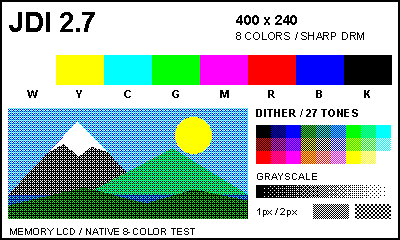
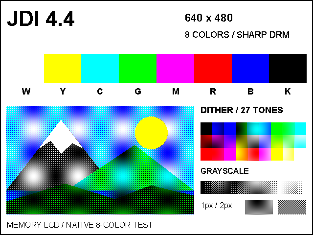
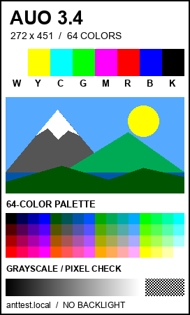

# サンプル画像

[English](README.md) | 日本語

RGBの並び、解像度、色の再現、細かなピクセルを確認するテスト画像です。
各画像は対象パネルと同じ解像度で保存しています。

| 画像 | 対象パネル | 解像度 | 色モード |
| --- | --- | --- | --- |
| [横向き 400x240](images/test-pattern-400x240-8color.png) | JDI LPM027M128B / LPM027M128C | 400x240 | 8色 |
| [横向き 640x480](images/test-pattern-640x480-8color.png) | JDI LPM044M141A | 640x480 | 8色 |
| [元の縦向き 272x451](images/test-pattern-272x451-64color.png) | AUO U340QBN01 | 272x451 | 64色 |







横向きPNGの使用色は、黒・白・赤・緑・青・シアン・マゼンタ・黄の8色です。
山のイラスト、27色の色見本、グレースケールの中間色は、4x4の順序ディザを
画像に埋め込んで表現しています。文字、カラーバー、1ピクセル・2ピクセルの
市松模様には基本色を直接使っています。

確認パターンを維持するため、拡大縮小せず等倍で表示してください。
ドライバは `colors=8` を指定し、`dither_algo=0` にすると画像に埋め込んだ
ピクセルをそのまま確認できます。バックライトは必須ではありません。

縦向き画像は `anttest.local` に接続したAUOパネルで表示を確認した元のRGB PNGを
そのまま保存しています。フッターも元の表記を残しています。ドライバによる
64色変換用の中間色を含むため、PNG自体の使用色数は64色を超えます。
横向きの2画像は解像度・使用色・レイアウトを確認済みですが、対象パネルでの
実機表示はまだ確認していません。

## 横向き画像の再生成

Pillowをインストールし、リポジトリのルートで実行します。

```sh
python3 -m pip install Pillow
python3 scripts/generate_sample_images.py
```

フォントはmacOSではArial、LinuxではDejaVu SansまたはLiberation Sansを
使用します。フォントによって文字の形が変わることがあります。
元の縦向きPNGは、このスクリプトでは上書きしません。
